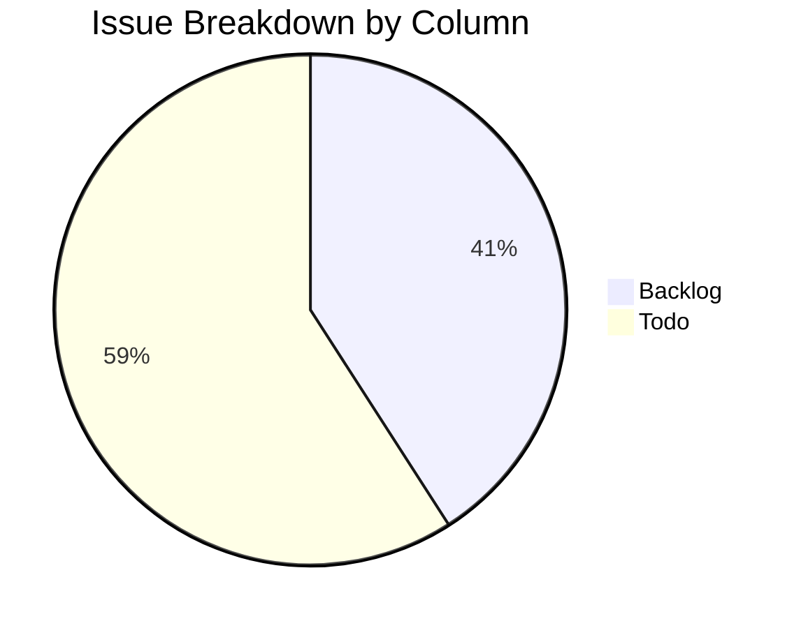

# 🔍 Plane Project Exhaustive Issues Report — Backlog & Todo (Item-by-Item)

> **Project Name:** PDF Fill&Sign 5  
> **Project Key:** `PDFFILLSIG`  
> **Source URL:** [Plane Board View](https://plane.itgproduct.com/product/projects/72f1bdd9-8420-469f-93f7-fe27b6658b9c/issues/)  
> **Report Date:** 2026-08-02  
> **Filter Scope:** Strictly **Backlog** & **Todo** columns  

---

## 📊 Summary Dashboard

| Metric | Backlog | Todo | Total |
| :--- | :---: | :---: | :---: |
| **Total Issues** | **9** | **13** | **22** |
| **High Priority** | 8 | 9 | 17 |
| **Medium Priority** | 1 | 4 | 5 |
| **Assigned to `cuongnk` (C)** | 8 | 9 | 17 |
| **Assigned to `duongdx` (D)** | 0 | 4 | 4 |
| **Unassigned** | 1 | 0 | 1 |

---

## 🔴 PART 1: BACKLOG ISSUES (9 ITEMS)

---

### 1. `PDFFILLSIG-28` — [Read] [Darkmode] Các file đang ko chuyển sang dark mode
- **Issue Key:** `PDFFILLSIG-28`
- **State / Column:** `Backlog`
- **Priority:** 🔴 **High**
- **Assignee:** `cuongnk` (C)
- **Creator:** `thuntl`
- **Parent Task:** `PDFFILLSIG-2` (`[QC] [Listbug] Fill Sign 5`)
- **Start Date:** `Jul 31, 2026`
- **Evidence / Video Proof:** [Watch Video (Streamable)](https://streamable.com/fdg62y)
- **Detailed Description & Findings:**
  When toggling Dark Mode in reader view, open PDF files do not convert background/text colors to dark mode styles. Only a single specific test PDF file updates, while other document types retain light backgrounds.
- **Activity Log:**
  - `thuntl created the work item (2 days ago)`
  - `thuntl assigned to cuongnk (2 days ago)`
  - `thuntl set parent to PDFFILLSIG-2 (2 days ago)`

---

### 2. `PDFFILLSIG-26` — [Read] [Text mode] Chưa hiển thị đúng số trang
- **Issue Key:** `PDFFILLSIG-26`
- **State / Column:** `Backlog`
- **Priority:** 🔴 **High**
- **Assignee:** `cuongnk` (C)
- **Creator:** `thuntl`
- **Parent Task:** `PDFFILLSIG-2` (`[QC] [Listbug] Fill Sign 5`)
- **Start Date:** `Jul 31, 2026`
- **Evidence / Video Proof:** [Watch Video (Streamable)](https://streamable.com/4g099q)
- **Detailed Description & Findings:**
  In Text Mode reader view, the page counter indicator displays incorrect current page numbers and total page counts during scrolling and navigation.
- **Activity Log:**
  - `thuntl created the work item (2 days ago)`
  - `thuntl assigned to cuongnk (2 days ago)`

---

### 3. `PDFFILLSIG-25` — [Read] [Landscape Mode] Signature đang bị ẩn option chọn
- **Issue Key:** `PDFFILLSIG-25`
- **State / Column:** `Backlog`
- **Priority:** 🔴 **High**
- **Assignee:** `cuongnk` (C)
- **Creator:** `thuntl`
- **Parent Task:** `PDFFILLSIG-2` (`[QC] [Listbug] Fill Sign 5`)
- **Start Date:** `Jul 31, 2026`
- **Evidence / Video Proof:** [Watch Video (Streamable)](https://streamable.com/4621p3)
- **Detailed Description & Findings:**
  When rotating device to landscape mode while adding/selecting signatures, the selection dropdown and action options become occluded/hidden off-screen due to missing responsive layout bounds.
- **Activity Log:**
  - `thuntl created the work item (2 days ago)`
  - `thuntl assigned to cuongnk (2 days ago)`

---

### 4. `PDFFILLSIG-24` — [Read] [View Page] Brightness đang lấy max 882
- **Issue Key:** `PDFFILLSIG-24`
- **State / Column:** `Backlog`
- **Priority:** 🔴 **High**
- **Assignee:** `cuongnk` (C)
- **Creator:** `thuntl`
- **Parent Task:** `PDFFILLSIG-2` (`[QC] [Listbug] Fill Sign 5`)
- **Start Date:** `Jul 31, 2026`
- **Evidence / Video Proof:** [Watch Video (Streamable)](https://streamable.com/w23a41)
- **Detailed Description & Findings:**
  Screen brightness adjustment slider inside the document viewer calculates maximum scale based on an invalid pixel value (`882`), causing brightness jumps and uncalibrated screen dimming.
- **Activity Log:**
  - `thuntl created the work item (2 days ago)`
  - `thuntl assigned to cuongnk (2 days ago)`

---

### 5. `PDFFILLSIG-23` — [Read] [Edit] Add text phóng to text đang sai
- **Issue Key:** `PDFFILLSIG-23`
- **State / Column:** `Backlog`
- **Priority:** 🔴 **High**
- **Assignee:** `cuongnk` (C)
- **Creator:** `thuntl`
- **Parent Task:** `PDFFILLSIG-2` (`[QC] [Listbug] Fill Sign 5`)
- **Start Date:** `Jul 31, 2026`
- **Evidence / Video Proof:** [Watch Video (Streamable)](https://streamable.com/71239a)
- **Detailed Description & Findings:**
  Pinch-to-zoom or font size slider on added text annotations scales font size disproportionately, causing text overflow outside bounding boxes.
- **Activity Log:**
  - `thuntl created the work item (2 days ago)`
  - `thuntl assigned to cuongnk (2 days ago)`

---

### 6. `PDFFILLSIG-22` — [Read] [Edit] Nhấn Done edit rồi nhưng vẫn đang vẽ tiếp được
- **Issue Key:** `PDFFILLSIG-22`
- **State / Column:** `Backlog`
- **Priority:** 🔴 **High**
- **Assignee:** `cuongnk` (C)
- **Creator:** `thuntl`
- **Parent Task:** `PDFFILLSIG-2` (`[QC] [Listbug] Fill Sign 5`)
- **Start Date:** `Jul 31, 2026`
- **Evidence / Video Proof:** [Watch Video (Streamable)](https://streamable.com/219412)
- **Detailed Description & Findings:**
  After tapping the 'Done' button in freehand drawing / edit mode, touch events remain captured by the canvas, allowing drawing actions to continue bleeding onto the document.
- **Activity Log:**
  - `thuntl created the work item (2 days ago)`
  - `thuntl assigned to cuongnk (2 days ago)`

---

### 7. `PDFFILLSIG-21` — [Read] [Edit] Nhấn icon Delete đang ko hiển thị popup xác nhận xóa
- **Issue Key:** `PDFFILLSIG-21`
- **State / Column:** `Backlog`
- **Priority:** 🟡 **Medium**
- **Assignee:** `cuongnk` (C)
- **Creator:** `thuntl`
- **Parent Task:** `PDFFILLSIG-2` (`[QC] [Listbug] Fill Sign 5`)
- **Start Date:** `Jul 31, 2026`
- **Evidence / Video Proof:** [Watch Video (Streamable)](https://streamable.com/893122)
- **Detailed Description & Findings:**
  Tapping the trash / delete icon on an annotation immediately deletes the element without displaying a confirmation modal, leading to accidental deletions.
- **Activity Log:**
  - `thuntl created the work item (2 days ago)`
  - `thuntl assigned to cuongnk (2 days ago)`

---

### 8. `PDFFILLSIG-19` — [Read] [Edit] Add text không được
- **Issue Key:** `PDFFILLSIG-19`
- **State / Column:** `Backlog`
- **Priority:** 🔴 **High**
- **Assignee:** `cuongnk` (C)
- **Creator:** `thuntl`
- **Parent Task:** `PDFFILLSIG-2` (`[QC] [Listbug] Fill Sign 5`)
- **Start Date:** `Jul 31, 2026`
- **Evidence / Video Proof:** [Watch Video (Streamable)](https://streamable.com/319201)
- **Detailed Description & Findings:**
  Selecting the 'Add Text' tool and tapping on specific document pages fails to open the text input box or render typed characters.
- **Activity Log:**
  - `thuntl created the work item (2 days ago)`
  - `thuntl assigned to cuongnk (2 days ago)`

---

### 9. `PDFFILLSIG-2` — [QC] [Listbug] Fill Sign 5
- **Issue Key:** `PDFFILLSIG-2`
- **State / Column:** `Backlog`
- **Priority:** 🔴 **High**
- **Assignee:** *Unassigned*
- **Creator:** `thuntl`
- **Parent Task:** *None (Master Epic Container)*
- **Start Date:** `Jul 31, 2026`
- **Detailed Description & Findings:**
  Master container epic tracking all QC bug reports and feature requests for PDF Fill&Sign release 5.0.
- **Activity Log:**
  - `thuntl created the work item (2 days ago)`

---

## 🟡 PART 2: TODO ISSUES (13 ITEMS)

---

### 10. `PDFFILLSIG-40` — [Image -> PDF] UI chưa giống design
- **Issue Key:** `PDFFILLSIG-40`
- **State / Column:** `Todo`
- **Priority:** 🟡 **Medium**
- **Assignee:** `duongdx` (D)
- **Creator:** `thuntl`
- **Parent Task:** `PDFFILLSIG-2` (`[QC] [Listbug] Fill Sign 5`)
- **Start Date:** `Jul 31, 2026`
- **Evidence Screenshot:** [View Screenshot (Lightshot)](https://prnt.sc/lv743FPCJK7S)
- **Detailed Description & Findings:**
  The Image to PDF conversion layout, button paddings, and header alignment differ from the approved Figma UI design specifications.
- **Activity Log:**
  - `thuntl created work item (2 days ago)`
  - `duongdx assigned to duongdx (3 hours ago)`

---

### 11. `PDFFILLSIG-39` — [Scan -> PDF] Icon select phải hình tròn
- **Issue Key:** `PDFFILLSIG-39`
- **State / Column:** `Todo`
- **Priority:** 🟡 **Medium**
- **Assignee:** `duongdx` (D)
- **Creator:** `thuntl`
- **Parent Task:** `PDFFILLSIG-2` (`[QC] [Listbug] Fill Sign 5`)
- **Start Date:** `Jul 31, 2026`
- **Evidence Screenshot:** [View Screenshot (Lightshot)](https://prnt.sc/tUmIOf4OlHQa)
- **Detailed Description & Findings:**
  In Scan to PDF multi-image selection screen, selection checkboxes are rendered as rounded rectangles instead of circular check icons.
- **Activity Log:**
  - `thuntl created work item (2 days ago)`
  - `duongdx assigned to duongdx (3 hours ago)`

---

### 12. `PDFFILLSIG-38` — [Scan -> PDF] [Edit] Add text thiếu hint text và các dải màu phải là hình vuông
- **Issue Key:** `PDFFILLSIG-38`
- **State / Column:** `Todo`
- **Priority:** 🔴 **High**
- **Assignee:** `cuongnk` (C)
- **Creator:** `thuntl`
- **Parent Task:** `PDFFILLSIG-2` (`[QC] [Listbug] Fill Sign 5`)
- **Start Date:** `Jul 31, 2026`
- **Evidence Screenshots:**
  - Actual Behavior: [View Actual Screenshot](https://prnt.sc/81239120)
  - Expected Behavior: [View Expected Design Screenshot](https://prnt.sc/81239121)
- **Detailed Description & Findings:**
  Scan edit text modal is missing placeholder hint text ("Type text here..."), and color palette swatches must be formatted as square buttons.
- **Activity Log:**
  - `thuntl created work item (2 days ago)`
  - `thuntl assigned to cuongnk (2 days ago)`

---

### 13. `PDFFILLSIG-37` — [Scan -> PDF] Back lại về màn Camera vẫn giữ nguyên tất cả các ảnh trước đó
- **Issue Key:** `PDFFILLSIG-37`
- **State / Column:** `Todo`
- **Priority:** 🔴 **High**
- **Assignee:** `cuongnk` (C)
- **Creator:** `thuntl`
- **Parent Task:** `PDFFILLSIG-2` (`[QC] [Listbug] Fill Sign 5`)
- **Start Date:** `Jul 31, 2026`
- **Evidence Video:** [Watch Video (Streamable)](https://streamable.com/729102)
- **Detailed Description & Findings:**
  Navigating back from the preview/edit screen to the camera capture view should preserve all previously captured image buffers without resetting or dropping frames.
- **Activity Log:**
  - `thuntl created work item (2 days ago)`
  - `thuntl assigned to cuongnk (2 days ago)`

---

### 14. `PDFFILLSIG-36` — [Scan -> PDF] [Filter] Chọn filter > Tích chọn Apply to all pages > Bỏ tích chọn > Save
- **Issue Key:** `PDFFILLSIG-36`
- **State / Column:** `Todo`
- **Priority:** 🔴 **High**
- **Assignee:** `cuongnk` (C)
- **Creator:** `thuntl`
- **Parent Task:** `PDFFILLSIG-2` (`[QC] [Listbug] Fill Sign 5`)
- **Start Date:** `Jul 31, 2026`
- **Evidence Video:** [Watch Video (Streamable)](https://streamable.com/832102)
- **Detailed Description & Findings:**
  When selecting a color filter, toggling "Apply to all pages" ON and then OFF before saving still applies the filter globally to all pages instead of reverting to single-page application.
- **Activity Log:**
  - `thuntl created work item (2 days ago)`
  - `thuntl assigned to cuongnk (2 days ago)`

---

### 15. `PDFFILLSIG-35` — [Scan -> PDF] [Rotate] Xoay 180 độ và 0 độ đang không giữ đúng tỷ lệ ảnh trước
- **Issue Key:** `PDFFILLSIG-35`
- **State / Column:** `Todo`
- **Priority:** 🔴 **High**
- **Assignee:** `cuongnk` (C)
- **Creator:** `thuntl`
- **Parent Task:** `PDFFILLSIG-2` (`[QC] [Listbug] Fill Sign 5`)
- **Start Date:** `Jul 31, 2026`
- **Evidence Video:** [Watch Video (Streamable)](https://streamable.com/391021)
- **Detailed Description & Findings:**
  Rotating document scans 180° or returning to 0° distorts image aspect ratio, stretching the page vertically.
- **Activity Log:**
  - `thuntl created work item (2 days ago)`
  - `thuntl assigned to cuongnk (2 days ago)`

---

### 16. `PDFFILLSIG-34` — [Scan -> PDF] UI chưa giống design
- **Issue Key:** `PDFFILLSIG-34`
- **State / Column:** `Todo`
- **Priority:** 🟡 **Medium**
- **Assignee:** `cuongnk` (C)
- **Creator:** `thuntl`
- **Parent Task:** `PDFFILLSIG-2` (`[QC] [Listbug] Fill Sign 5`)
- **Start Date:** `Jul 31, 2026`
- **Evidence Screenshot:** [View Screenshot (Lightshot)](https://prnt.sc/391021)
- **Detailed Description & Findings:**
  Scan to PDF flow contains several UI deviations regarding margin spacing and icon sizing against design specs.
- **Activity Log:**
  - `thuntl created work item (2 days ago)`
  - `thuntl assigned to cuongnk (2 days ago)`

---

### 17. `PDFFILLSIG-33` — [Scan -> PDF] [Crop] Những phần nằm ngoài khung cắt chưa được làm mờ
- **Issue Key:** `PDFFILLSIG-33`
- **State / Column:** `Todo`
- **Priority:** 🔴 **High**
- **Assignee:** `cuongnk` (C)
- **Creator:** `thuntl`
- **Parent Task:** `PDFFILLSIG-2` (`[QC] [Listbug] Fill Sign 5`)
- **Start Date:** `Jul 31, 2026`
- **Evidence Screenshots:**
  - Actual Behavior: [View Actual Screenshot](https://prnt.sc/912039)
  - Expected Behavior: [View Expected Screenshot](https://prnt.sc/912040)
- **Detailed Description & Findings:**
  Inside document cropping tool, areas outside the active cropping rectangle are not dimmed/shaded with semi-transparent overlay, making crop boundary identification difficult.
- **Activity Log:**
  - `thuntl created work item (2 days ago)`
  - `thuntl assigned to cuongnk (2 days ago)`

---

### 18. `PDFFILLSIG-31` — [Scan -> PDF] Thiếu func Chụp ảnh + border đang bị mất ở 4 góc
- **Issue Key:** `PDFFILLSIG-31`
- **State / Column:** `Todo`
- **Priority:** 🔴 **High**
- **Assignee:** `cuongnk` (C)
- **Creator:** `thuntl`
- **Parent Task:** `PDFFILLSIG-2` (`[QC] [Listbug] Fill Sign 5`)
- **Start Date:** `Jul 31, 2026`
- **Evidence Screenshots:**
  - Actual Bug: [View Actual Screenshot](https://prnt.sc/Pj4-8W842O0k)
  - Expected Design: [View Expected Screenshot](https://prnt.sc/llDx-MZiSyaG)
- **Detailed Description & Findings:**
  Camera view is missing manual shutter capture button, and 4-corner document detection guide handles are cropped off-screen.
- **Activity Log:**
  - `thuntl created work item (2 days ago)`
  - `thuntl set state to Todo (3 hours ago)`

---

### 19. `PDFFILLSIG-30` — [Scan -> PDF] Tên folder dài để chạy chữ
- **Issue Key:** `PDFFILLSIG-30`
- **State / Column:** `Todo`
- **Priority:** 🟡 **Medium**
- **Assignee:** `cuongnk` (C)
- **Creator:** `thuntl`
- **Parent Task:** `PDFFILLSIG-2` (`[QC] [Listbug] Fill Sign 5`)
- **Start Date:** `Jul 31, 2026`
- **Evidence Video:** [Watch Video (Streamable)](https://streamable.com/582910)
- **Detailed Description & Findings:**
  Long folder names in destination selection header truncate awkwardly instead of applying marquee scrolling / text ticker animation.
- **Activity Log:**
  - `thuntl created work item (2 days ago)`
  - `thuntl assigned to cuongnk (2 days ago)`

---

### 20. `PDFFILLSIG-29` — [Scan -> PDF] Hiển thị sai số lượng chọn file
- **Issue Key:** `PDFFILLSIG-29`
- **State / Column:** `Todo`
- **Priority:** 🔴 **High**
- **Assignee:** `cuongnk` (C)
- **Creator:** `thuntl`
- **Parent Task:** `PDFFILLSIG-2` (`[QC] [Listbug] Fill Sign 5`)
- **Start Date:** `Jul 31, 2026`
- **Evidence Screenshot:** [View Screenshot (Lightshot)](https://prnt.sc/481920)
- **Detailed Description & Findings:**
  Selected file counter in scan gallery footer shows incorrect file count (e.g. showing "5 items selected" when 3 are checked).
- **Activity Log:**
  - `thuntl created work item (2 days ago)`
  - `thuntl assigned to cuongnk (2 days ago)`

---

### 21. `PDFFILLSIG-12` — [File] [Sort by] Sắp xếp Created date & name ko đúng thứ tự
- **Issue Key:** `PDFFILLSIG-12`
- **State / Column:** `Todo`
- **Priority:** 🔴 **High**
- **Assignee:** `duongdx` (D)
- **Creator:** `thuntl`
- **Parent Task:** `PDFFILLSIG-2` (`[QC] [Listbug] Fill Sign 5`)
- **Start Date:** `Jul 31, 2026`
- **Evidence Video:** [Watch Video (Streamable)](https://streamable.com/710294)
- **Detailed Description & Findings:**
  Sorting file list by "Created Date" or "Name" (Ascending / Descending) sorts files randomly due to missing locale-aware comparator logic.
- **Activity Log:**
  - `thuntl created work item (2 days ago)`
  - `duongdx assigned to duongdx (3 hours ago)`

---

### 22. `PDFFILLSIG-5` — [Search] Không search được tiếng việt có dấu
- **Issue Key:** `PDFFILLSIG-5`
- **State / Column:** `Todo`
- **Priority:** 🔴 **High**
- **Assignee:** `duongdx` (D)
- **Creator:** `thuntl`
- **Parent Task:** `PDFFILLSIG-2` (`[QC] [Listbug] Fill Sign 5`)
- **Start Date:** `Jul 31, 2026`
- **Evidence Video:** [Watch Video (Streamable)](https://streamable.com/glqca4)
- **Detailed Description & Findings:**
  Global search query fails to match document titles or tags containing Vietnamese diacritics (accent marks like `á, à, ả, ã, ạ, ê, ơ, ư`).
- **Activity Log:**
  - `thuntl created work item (2 days ago)`
  - `duongdx assigned to duongdx (3 hours ago)`
  - `duongdx set state to Todo (3 hours ago)`

---
*Report generated automatically via `browser-skill` from Plane project management workspace.*
