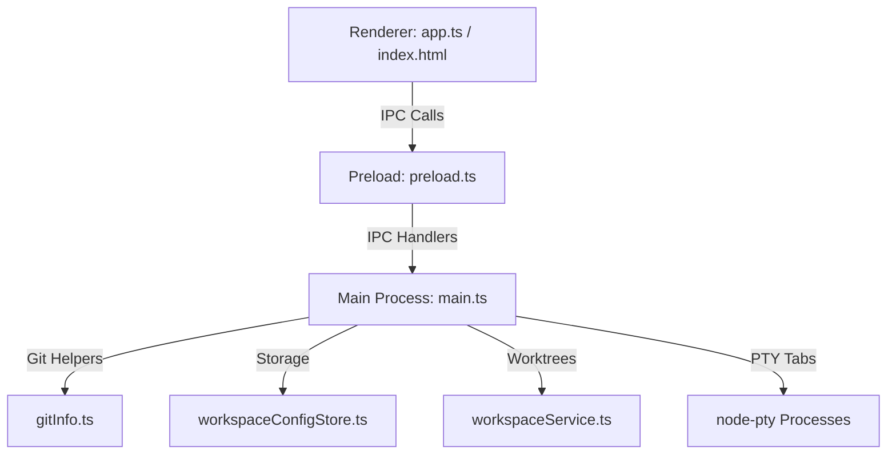

# Coding Space

Coding Space is a high-performance developer workspace manager built on Electron and TypeScript. It is designed to supercharge development workflows using Git worktrees, allowing you to manage multiple branches concurrently, share large directories efficiently via symlinks, integrate advanced AI agent toolkits (BMAD-METHOD, OpenSpec), and operate with custom-built terminal interfaces.

---

## 🚀 Key Features

### 1. **Advanced Git Worktree Orchestration**
- **Automated Scanning:** Automatically scans your project directories to detect and track active Git worktrees.
- **Worktree Lifecycle Management:** Create, initialize, and remove worktrees directly from the UI. Includes force-remove safety toggles.
- **Integrated Git Syncing:** Fetch remote changes, pull updates, and create/merge branches within specific worktrees.
- **Dashboard Overview:** View active branches, modified status, ahead/behind counts, and recent commits at a glance.

### 2. 🔗 **Symlink & Shared Resource Management**
- **Zero-Duplication Directory Sharing:** Share large directories (such as `node_modules`, large asset pools, build caches, or datasets) between worktrees.
- **Symlink Scan & Detection:** Live status reporting indicating whether directories in the worktree are symlinked, real, or broken.
- **One-Click Toggling:** Instantly link/unlink targets, fully managed via a dedicated Symlink Modal in the user interface.

### 3. 🤖 **AI Agent Toolkit & Git-Exclude Integration**
- **Shared Toolkit Deployment:** Easily deploy shared AI skills, command definitions, and prompt templates (supporting BMAD-METHOD, OpenSpec, Antigravity, Claude, Codex, and OpenCode).
- **Auto Git-Exclude Management:** Automatically configures `.git/info/exclude` patterns for deployed toolkits, keeping your worktree's Git status clean while still enabling full AI capabilities.
- **Checklist Deployment:** Granular selection of which agent toolkits are linked and configured for each worktree.

### 4. 💻 **Embedded & External Terminal Systems**
- **Integrated Terminal Tabs:** Powered by [xterm.js](https://xtermjs.org/) and [node-pty](https://github.com/microsoft/node-pty) for high-performance terminal operations inside the app.
- **Terminal Resizing:** Drag-and-resize terminal panes to suit your workspace layout.
- **External Windows Terminal Toggle:** Switch from embedded tabs to spawning individual shells inside the official Windows Terminal in one click.

### 5. 🛠️ **Direct Integrations & Quick Launcher**
- **Direct Workspace Launchers:** Instantly launch VS Code, Android Studio, Antigravity, Antigravity Agent Manager, or Windows Explorer directly targeting the active worktree path.
- **Custom Tool Configurations:** Configure executable paths and global settings via the Settings Modal.

---

## 🛠️ Getting Started

### Requirements
- **OS:** Windows 10/11
- **Node.js:** v20+ / v25+ (Recommended)
- **Git:** Installed and available on your PATH

### Installation
Clone the repository and install all dependencies:
```bash
git clone https://github.com/impeterwayne/CodingSpace.git
cd CodingSpace
npm install
```

### Running in Development Mode
Build typescript files using `esbuild` and spin up the Electron app:
```bash
npm start
```

---

## 📦 Packaging and Distribution

You can bundle and build a production-ready application for Windows using `electron-builder`:

```bash
# Generate full NSIS installer and portable EXE
npm run make

# Windows-specific target explicitly (NSIS + Portable)
npm run make:win

# Fast packaging - creates unpacked directory for quick testing
npm run pack
```

### Build Artifacts
All compiled packages are saved to the `release/` directory:
- **`Coding Space-<version>-Setup.exe`:** NSIS Installer containing options for desktop and start menu shortcuts.
- **`Coding Space-<version>-Portable.exe`:** Single-binary portable version.
- **`win-unpacked/`:** The unpacked Electron binary files.

---

## 📂 Codebase Architecture

The application is structured into clearly separated main, preload, and renderer modules:



### Key Modules:
- **Main Process:** Handles app initialization, window state, PTY terminal processes, file system symlinking, and toolkit deployment.
  - Core: [src/main/main.ts](file:///D:/Quest/CodingSpace/src/main/main.ts)
  - IPC Registrations: [src/main/ipc/workspaceIpc.ts](file:///D:/Quest/CodingSpace/src/main/ipc/workspaceIpc.ts)
- **Preload Bridge:** Safe API boundary exposing main process systems to the renderer window.
  - Bridge: [src/main/preload.ts](file:///D:/Quest/CodingSpace/src/main/preload.ts)
- **Renderer Frontend:** The UI, styled with high-contrast elements, rendering terminal tabs, settings grids, worktree lists, and configuration settings.
  - View: [src/renderer/index.html](file:///D:/Quest/CodingSpace/src/renderer/index.html)
  - Controller: [src/renderer/app.ts](file:///D:/Quest/CodingSpace/src/renderer/app.ts)
  - Styles: [src/renderer/styles.css](file:///D:/Quest/CodingSpace/src/renderer/styles.css)
- **Shared Data & Services:**
  - Workspace Service: [src/application/workspaceService.ts](file:///D:/Quest/CodingSpace/src/application/workspaceService.ts)
  - Workspace Config Store: [src/application/workspaceConfigStore.ts](file:///D:/Quest/CodingSpace/src/application/workspaceConfigStore.ts)
