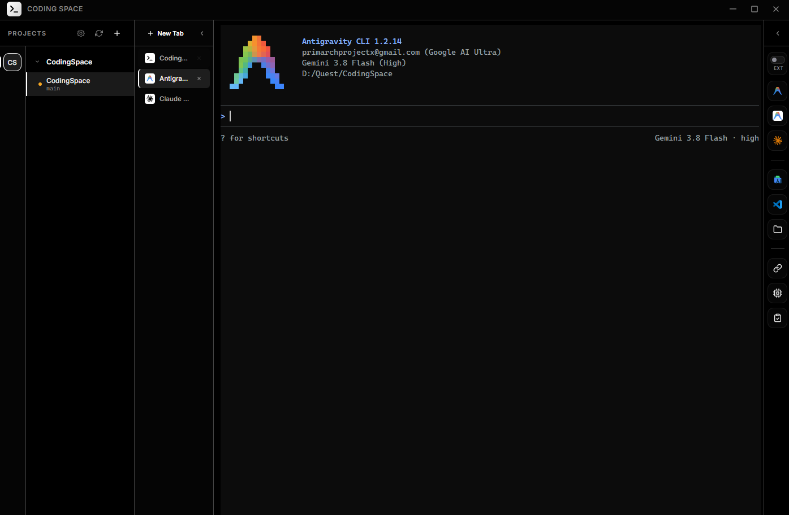

# Coding Space

[English](README.md) | [Tiếng Việt](README.vi.md)

Coding Space là trình quản lý không gian làm việc (workspace manager) dành cho lập trình viên, được xây dựng trên nền tảng Electron và TypeScript. Ứng dụng tối ưu hóa quy trình làm việc thông qua Git worktree, cho phép bạn quản lý song song nhiều nhánh (branch) cùng lúc, chia sẻ thư mục thông qua symlink, thiết lập bộ công cụ Android harness (Android Harness AGY / aha), và làm việc linh hoạt với giao diện terminal tích hợp hoặc mở ngoài.



## Tính năng nổi bật

- **Điều phối Git Worktree**: Tự động quét, quản lý vòng đời (tạo, xóa) và đồng bộ nhánh/merge trực tiếp ngay trên giao diện trực quan.
- **Quản lý Symlink**: Chia sẻ các thư mục có dung lượng lớn như `node_modules` hoặc thư mục assets giữa các worktree để tiết kiệm dung lượng ổ đĩa.
- **Thiết lập Android Harness AGY (`aha`)**: Cấu hình và triển khai các guardrail cho Android AI agent, quy tắc kiến trúc (XML / Compose), subagent tự động, deterministic hook và skill kỹ thuật với cấu hình tự động cho `.git/info/exclude`.
- **Tích hợp Terminal**: Hỗ trợ nhiều tab terminal tích hợp sử dụng xterm.js và node-pty với khả năng tùy chỉnh kích thước, kèm tùy chọn mở phiên làm việc trên terminal bên ngoài (Windows Terminal trên Windows, Terminal.app trên macOS, hoặc terminal emulator mặc định trên Linux). Menu tạo tab mới có đánh dấu cảnh báo cho các trình khởi chạy Codex (YOLO), Claude và Antigravity CLI đối với các phiên làm việc không chạy sandbox hoặc bỏ qua kiểm soát quyền.
- **Phím tắt Prefix**: Nhấn `Ctrl+B`, sau đó bấm phím tiếp theo trong vòng 2 giây — `c` / `Alt+T` mở terminal, `Alt+C` mở Claude, `Alt+Shift+C` mở Codex (YOLO), `Alt+A` mở Antigravity, `Alt+O` mở OpenCode. Nhấn `Ctrl+B` hai lần liên tiếp để gửi ký tự `Ctrl+B` thực tế vào terminal.
- **Khởi chạy nhanh (Quick Launcher)**: Khởi chạy 1-click cho VS Code, Android Studio, Antigravity IDE, Antigravity Agent Manager, Claude Desktop và trình quản lý tệp tin của hệ điều hành (Explorer / Finder / Files).

## Bắt đầu

### Yêu cầu hệ thống
- Windows 10/11, macOS 11+, hoặc desktop Linux x64 hiện đại
- Node.js (khuyến nghị v20+)
- Git
- Riêng Linux: Cần cài đặt C++ toolchain để biên dịch `node-pty` (`sudo apt install build-essential python3` trên Debian/Ubuntu)

### Cài đặt & Chạy ứng dụng
```bash
# Clone repository kèm submodule
git clone --recurse-submodules https://github.com/impeterwayne/CodingSpace.git
cd CodingSpace

# Nếu đã clone trước đó mà chưa có submodule, hãy khởi tạo:
# git submodule update --init --recursive

npm install
npm start
```

## Đóng gói ứng dụng (Packaging)

```bash
# Đóng gói cho hệ điều hành hiện tại theo các định dạng mặc định
npm run make

# Windows: Trình cài đặt NSIS + bản Portable EXE (x64)
npm run make:win

# macOS: DMG + ZIP (arm64 và x64) — cần chạy trên macOS
npm run make:mac

# Linux: AppImage + .deb (x64) — cần chạy trên Linux
npm run make:linux

# Đóng gói nhanh (thư mục chưa nén unpacked)
npm run pack
```

Tất cả các bản build đầu ra sẽ được lưu trong thư mục `release/`.

Do `node-pty` là một native module, việc đóng gói cho từng nền tảng bắt buộc phải được thực hiện trên chính nền tảng đó.
[Build workflow](.github/workflows/build.yml) trên GitHub Actions đã tự động hóa quy trình này cho cả ba hệ điều hành —
bạn có thể kích hoạt thủ công hoặc đẩy một git tag `v*`, sau đó tải về các bộ cài đặt từ mục artifacts của workflow run.

Các bản build macOS chưa được ký mã (code-signed) hoặc công chứng (notarized). Sau khi tải về, hãy nhấp chuột phải vào ứng dụng →
chọn **Open**, hoặc xóa cờ cách ly (quarantine flag) bằng câu lệnh:
```bash
xattr -cr "/Applications/Coding Space.app"
```

## Kiến trúc mã nguồn

- **Main Process**: [src/main/main.ts](src/main/main.ts) & [src/main/ipc/workspaceIpc.ts](src/main/ipc/workspaceIpc.ts)
- **Preload Bridge**: [src/main/preload.ts](src/main/preload.ts)
- **Renderer Frontend**: [src/renderer/index.html](src/renderer/index.html), [src/renderer/app.ts](src/renderer/app.ts), & [src/renderer/styles.css](src/renderer/styles.css)
- **Services**: [src/application/workspaceService.ts](src/application/workspaceService.ts) & [src/application/workspaceConfigStore.ts](src/application/workspaceConfigStore.ts)
